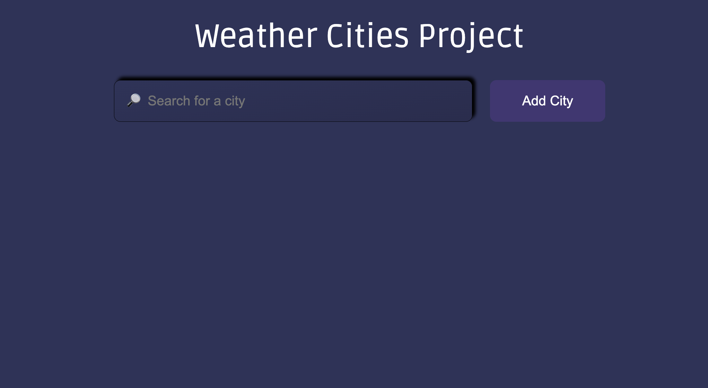
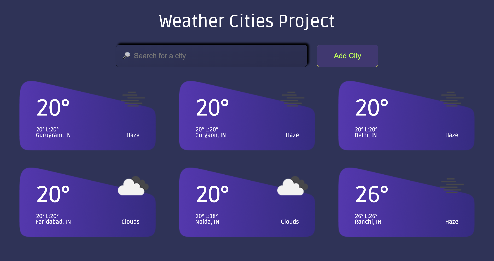

# Weather Display App

The Weather Web App is a simple web application built with Vanilla JS, CSS, and HTML. It fetches weather data from the openweathermap.org API, allowing users to search for cities and displays the searched cities' weather information based on temperature in increasing order. The UI is designed to be responsive, providing a seamless experience on various devices.

## Table of Contents

- [Features](#features)
- [Technologies Used](#technologies-used)
- [Getting Started](#getting-started)
- [City Search](#city-search)
- [Responsive UI](#responsive-ui)
- [Contributing](#contributing)
- [License](#license)

## Features

1. **Weather Data Display:**

   - Fetches weather data from openweathermap.org API.
   - Displays temperature, weather conditions, and other relevant information.

2. **City Search:**

   - Users can search for cities to get weather information.
   - Searched cities' data is displayed on the screen based on temperature in increasing order.

3. **Responsive UI:**
   - Designed with a responsive layout for optimal viewing on various devices.
   - Ensures a seamless user experience on desktops, tablets, and mobile phones.

## Technologies Used

- **Frontend:**
  - Vanilla JavaScript
  - HTML5
  - CSS3

## Getting Started

1. Clone the repository:

   ```bash
   git clone https://github.com/Ankush-nitjsr/WeatherApp
   ```

## City Search

Open the index.html file in a web browser.

Enter the name of the city you want to search for in the provided input field.

Click the "Search" button.

The weather information for the searched city will be displayed on the screen.

## Responsive UI

The Weather Web App is designed with a responsive layout to adapt to different screen sizes. Whether you are using a desktop, tablet, or mobile phone, the UI will adjust for an optimal viewing experience.

## Contributing

Contributions are welcome! Please fork the repository and create a pull request.

## Screenshots

- **Initial Screen:**
  

- **Searched Results Screen:**
  
